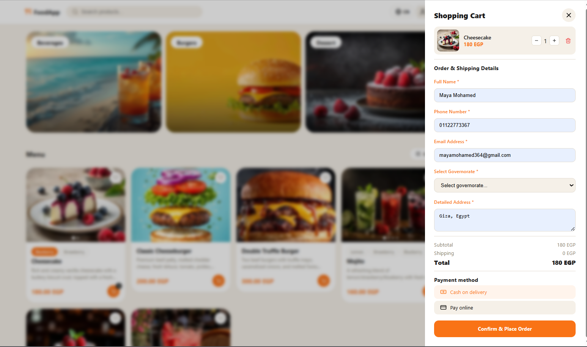
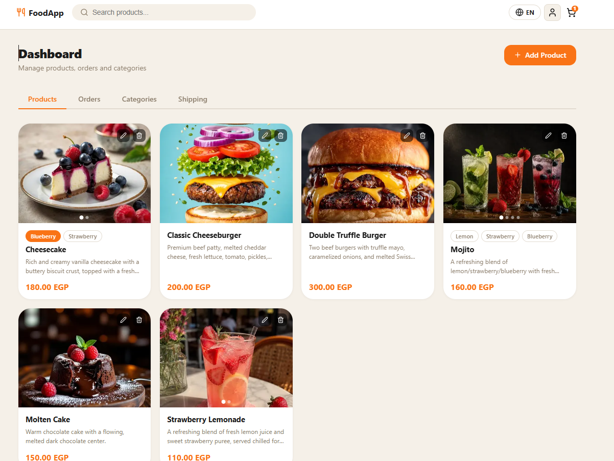

# FoodApp — Online Food Ordering Platform

**A full-featured food ordering web app — bilingual (AR/EN), real-time, and admin-ready.**

---

## Try it Live

**As a normal user** — browse, order, and track without an account:
[order-foodie.vercel.app](https://order-foodie.vercel.app)

- Click the profile icon in the navbar to sign in and view your orders
- No account needed to place an order as a guest

**As admin** — sign in to access the dashboard:
[order-foodie.vercel.app/login](https://order-foodie.vercel.app/login)
Email:    admin@admin.com
Password: 123456

## Preview

> **Homepage & Categories**
> 

> **Cart**
> 

> **Admin Dashboard**
> 
---

## Core Features

### Customer Experience

| Feature | Details |
|---|---|
| Bilingual | Full Arabic (RTL) & English support — persists across sessions |
| Persistent Cart | Cart survives page refresh via `localStorage` |
| Guest Checkout | No account required to place an order |
| Payment Options | Cash on Delivery or Online Payment |
| Shipping Zones | Choose governorate at checkout — price calculated automatically |
| Order Tracking | Track orders through: Pending → Preparing → On the way → Delivered |
| Search | Live search across product names in both languages |
| Category Filter | Filter by category with visual category cards |
| Sort & Filter | Sort by price (low→high / high→low), show favorites only |
| Favorites | Save favorite items — synced to your account via Supabase |

### Authentication

- Email + password sign-up / sign-in
- Show/hide password toggle
- Persistent sessions via Supabase Auth
- Role-based access: `admin` vs regular user

### Admin Dashboard

| Tab | What you can do |
|---|---|
| **Products** | Add / Edit / Delete products, upload multiple images, drag-to-reorder, add per-image labels, toggle availability |
| **Orders** | View all orders with full customer details — change status live, delete orders |
| **Categories** | Add / Edit / Delete categories with optional cover images |
| **Shipping** | Add / Delete shipping zones with Arabic & English names and pricing |

---

## Plus Features

### Multi-Image Products with Label Switcher

Each product supports multiple images with named variant labels (e.g. "Strawberry", "Chocolate").

- Clicking a label instantly swaps the displayed image
- Active label is highlighted
- Images and labels managed from the admin panel
- Drag-to-reorder images via `react-sortablejs`

### RTL / LTR Internationalization

- Toggle language via the globe button in the navbar
- RTL layout applied automatically for Arabic (`document.dir = 'rtl'`)
- Language preference saved to `localStorage`
- Every UI string uses `t('English text', 'النص العربي')`

### Mobile Image Carousel

Touch swipe support on product image galleries.

### Supabase Realtime

Order status changes reflect instantly in the admin panel without page refresh.

---
